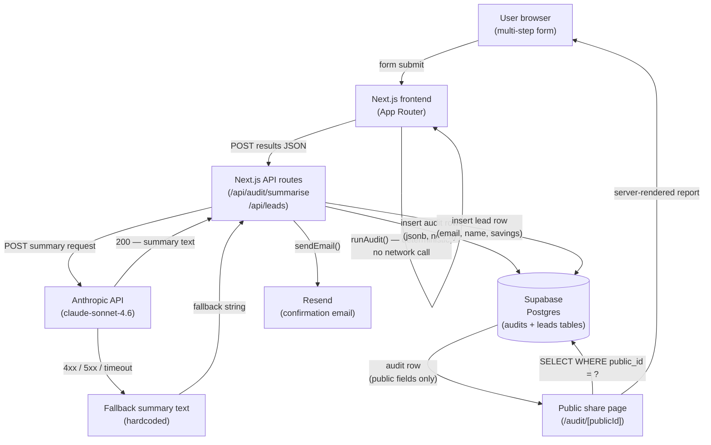

# Architecture

## Overview

AI Spend Auditor is a Next.js 14 App Router application that gathers AI subscription inputs via a multi-step client-side form, runs a deterministic rule-based audit against verified pricing data, and produces savings recommendations with citations to official vendor pricing pages. Results are persisted to Supabase as a PII-free public record and a PII-bearing lead record. An Anthropic-generated narrative summary is added server-side, with a hardcoded fallback if the API is unavailable.

---

## System Diagram

### Key design choices visible in the diagram

- **`runAudit()` is synchronous and local.** The audit engine makes no network calls. It runs entirely in the Next.js server process against `pricing-data.ts`, which is a static TypeScript module. This means audit latency is bounded by form-to-submit time, not by any external API.
- **Anthropic is non-blocking with a fallback.** The summary API route wraps the Anthropic call in a try/catch with a 10-second timeout. The results page never fails to render because of an Anthropic outage or quota error — it just shows the fallback string instead.
- **PII is segregated at write time.** The `audits` table row written at submission contains only the serialized `AuditReport` JSON and a generated `public_id` UUID. The `leads` table row is inserted separately and is service-role-only with no RLS `SELECT` policy accessible to the public. The two rows are linked by `audit_id` but the join is never exposed via the public share URL.

---

## Core modules

| Path | Purpose |
|---|---|
| `src/lib/audit/pricing-data.ts` | Static pricing data for all supported tools, manually verified from official vendor pages |
| `src/lib/audit/engine.ts` | Rule-based audit logic: free-tier eligibility, team-plan vs individual comparison, cheapest same-vendor plan, alternative tool suggestions |
| `src/lib/audit/types.ts` | All shared TypeScript types (`AuditReport`, `ToolAudit`, `PricingPlan`, etc.) |
| `src/lib/anthropic.ts` | Wraps Anthropic SDK; returns fallback string on any error |
| `src/lib/supabase/server.ts` | Service-role Supabase client for server-side writes |
| `src/lib/supabase/client.ts` | Anon-key Supabase client for client-side reads |
| `src/lib/resend.ts` | Resend email dispatch; single function, no templating library |
| `src/app/audit/page.tsx` | Multi-step client component: form state, `localStorage` persistence, audit submission |
| `src/app/audit/[publicId]/page.tsx` | Server component: reads `audits` row by `public_id`, renders read-only report |
| `src/app/api/audit/summarise/route.ts` | POST handler: receives `AuditReport`, calls Anthropic, returns summary string |
| `src/app/api/leads/route.ts` | POST handler: validates lead payload, writes to Supabase, triggers Resend |

---

## Data flow

1. User fills the multi-step form in the browser. Form state is written to `localStorage` under `auditai_draft` on every change so no progress is lost on refresh.
2. On submit, `runAudit(inputs)` executes synchronously in the browser, producing an `AuditReport` object.
3. The report is `POST`ed to `/api/audit/summarise`. The route handler: (a) generates a `public_id` UUID, (b) inserts the audit row into Supabase `audits`, (c) calls the Anthropic API for a summary paragraph, (d) returns `{ publicId, summary }` to the browser.
4. The browser navigates to `/audit/[publicId]` with the summary. The results page is server-rendered using the `publicId` to fetch the audit row from Supabase.
5. If the user submits the lead form, `/api/leads` inserts a `leads` row (email, name, `savings_monthly`, `audit_id`) and triggers a Resend confirmation email. The `leads` row is never readable via the public share URL.

---

## Security and privacy

- **No PII in public rows.** The `audits` table has a permissive RLS `SELECT` policy (readable by anyone with the `public_id`). It stores only the `AuditReport` JSON plus metadata — no name, email, or company.
- **Service role key is server-only.** `SUPABASE_SERVICE_ROLE_KEY` is used only in route handlers (`src/lib/supabase/server.ts`). It is never referenced in any client component or `NEXT_PUBLIC_*` variable.
- **Secrets are environment variables.** No API keys are committed. `.env.example` documents the shape; `.env.local` is gitignored.
- **Honeypot on lead form.** A hidden `website` field on the lead capture form is checked server-side in `/api/leads`. Non-empty value → 200 response with no action (silent drop, not a 400, to avoid tipping off bots).

---

## Scaling to 10k audits/day

10,000 audits/day is roughly 7 audits/minute sustained, with realistic peaks around 30–50/minute if a Reddit post or newsletter drives a traffic spike. The current architecture handles this without any changes. The following analysis applies to the next order of magnitude: **100k audits/day (~70/minute sustained, 300–500/minute at peak)**.

### Where the bottlenecks appear

**1. Supabase connection limits (hits first)**
The free Supabase tier allows 60 simultaneous Postgres connections. At 70 audits/minute, each requiring two sequential writes (audit insert + lead insert) with a ~50ms Postgres round-trip, the connection pool exhausts at roughly 50–80 concurrent requests. The symptom is not a hard error — it's `connection pool timeout` errors and p99 latency spikes above 5 seconds.

**2. Anthropic rate limits (hits second)**
The Anthropic API has per-minute token limits that vary by tier. At 100k audits/day, if even 30% of audits call the summary endpoint, that is 30,000 API calls/day (~21/minute). The current implementation calls this synchronously in the route handler and blocks the response. Under a traffic spike, in-flight Anthropic requests pile up and the 10-second timeout starts firing regularly, falling back to the hardcoded string. Users stop getting AI summaries.

**3. Next.js cold starts on serverless (hits at peak)**
Vercel's serverless runtime cold-starts a new function instance for bursts of traffic. The `src/app/api/audit/summarise/route.ts` handler imports the Anthropic SDK, which is not trivial to initialize. Cold start latency for this route is 800ms–1.5s on a fresh instance. At steady load this amortizes away; at a sharp spike (Reddit front page) it compounds with Supabase contention to push p99 response times above 10 seconds.

**4. `pricing-data.ts` module size (minor)**
`pricing-data.ts` is ~13KB of static TypeScript. It is bundled into the server-side code at build time and loaded into memory on every cold start. At current size this is negligible. If the tool expands to 50+ tools, consider lazy-loading pricing data from a Supabase table instead so it can be updated without a redeploy and doesn't contribute to cold start memory pressure.

### What to change

**Supabase → Supabase + PgBouncer (connection pooling)**
Enable PgBouncer in transaction mode via the Supabase dashboard (available on Pro tier). This multiplexes application connections through a pool so 500 concurrent Next.js function instances share 20–30 actual Postgres connections. This is the single highest-leverage change and unblocks most of the scaling headroom.

**Anthropic summary → background queue**
Decouple the summary generation from the audit submission response. The flow becomes: (1) submit audit → Supabase write → return `publicId` immediately, (2) enqueue a summary job to a queue (Upstash QStash is the obvious choice on Vercel), (3) a background worker calls Anthropic and updates the `audits` row with the summary. The results page polls or uses Supabase Realtime to show the summary when it appears. This eliminates the Anthropic call from the critical path and removes the 10-second timeout as a latency ceiling.

**Static assets → CDN caching**
The landing page and the public share pages are effectively static for any given `publicId`. Add `Cache-Control: public, max-age=3600, stale-while-revalidate=86400` headers to the share page route. On Vercel this is enough to push share page hits to the edge cache and eliminate the Supabase read for repeated views of the same report. This disproportionately helps because share links are the viral surface — if a report gets shared on X, it gets viewed many times by the same unique `publicId`.

**API routes → Vercel Edge Functions (selective)**
The `/api/leads` route does a honeypot check, a Supabase write, and a Resend call. The honeypot check and input validation can run at the edge with near-zero cold start latency. The Supabase write and Resend call can be offloaded to a background task via `waitUntil()` (available in the Edge runtime via Vercel's `@vercel/functions` package). This reduces p50 response time for lead submission from ~400ms to ~80ms and eliminates the cold start contribution entirely for that route.

**Pricing data → Supabase table with ISR cache**
At scale, the ability to update pricing without a redeploy becomes operationally important. Move `pricing-data.ts` to a Supabase table and fetch it server-side with Next.js Incremental Static Regeneration (ISR) at a 1-hour revalidation window. The audit engine reads from the cached fetch result during the revalidation window and gets fresh data on the next revalidation. Pricing changes propagate within an hour with no deployment needed.
